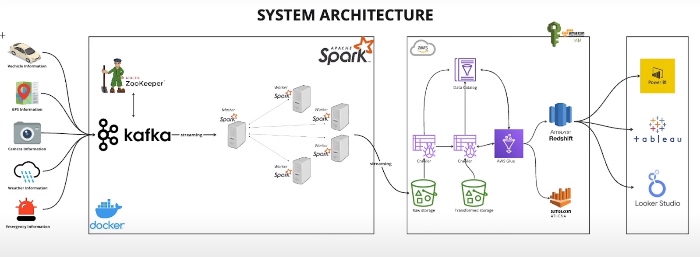

# Smart City

Objective of this project is to smartly monitor a city and for this purpose, we mimic the data extraction from streaming APIs like `vehicle, gps, traffic, weather and emergency` and then produce the data in Kafka topics in real-time and then process the data in
real-time using Spark streaming and store in AWS S3 bucket. After that we run the AWS Glue crawler to extract data from s3 bucket
and store analytics in AWS redshift and which can be connected to PowerBI to give real time analytics dashboard.

# Smart City Pipeline Architecture


# How to Setup and Run Project

- Clone this repo in your system and go to `smart-city` directory
```bash 
cd smart-city
```

- Rename `aws_config.py` to `config.py` and replace aws credentials with your AWS user credentials.

- Create a virtual env and activate it and then install required packages, replace `venv_name` with any prefered name
```bash 
python3 -m venv <venv_name>
source <venv_name>/bin/activate
pip install -r requirements.txt
```

- Run Kafka and Spark containers,
```bash 
docker-compose up -d
```

- You can view Spark Cluster UI at `localhost:9090`

- Create an S3 bucket with any given name and attach the following policy with S3 bucket,
```bash 
{
    "Version": "2012-10-17",
    "Id": "Policy1708964691216",
    "Statement": [
        {
            "Sid": "Stmt1708964685647",
            "Effect": "Allow",
            "Principal": "*",
            "Action": [
                "s3:GetObject",
                "s3:PutObject",
                "s3:PutObjectAcl"
            ],
            "Resource": "arn:aws:s3:::smartcity-spark-streaming-data/*"
        }
    ]
}
```

- Make sure the AWS user whose credentials you are using in `config.py` must have S3 bucket access

- Now run the spark job in spark container to process stream data from kafka topics and store it in S3 bucket 
by executing the below command,
```bash 
docker exec -it smart-city-spark-master-1 spark-submit \
--master spark://spark-master:7077 \
--packages org.apache.spark:spark-sql-kafka-0-10_2.12:3.5.0,org.apache.hadoop:hadoop-aws:3.3.1,com.amazonaws:aws-java-sdk:1.11.469 \
jobs/spark-city.py
```

- Produce data in the kafka topics by running the below command,
```bash
python3 jobs/main.py
```

- Kafka commands to list and delete the topics, also to view the topics data,
```bash
kafka-topics --list --bootstrap-server broker:29092
kafka-topics --delete --topic gps_data --bootstrap-server broker:29092
kafka-console-consumer --bootstrap-server broker:29092 --topic <topic_name> --from-beginning
```

- Now, create an `AWS Glue Crawler` and link the S3 bucket path with it and once you run the crawler, you will be able to query
your data using `AWS Athena`

- Finally, create a `redshift cluster` and create a schema linked with AWS Glue database. Make sure the redshift IAM role have access
to AWS S3 and Glue services. 